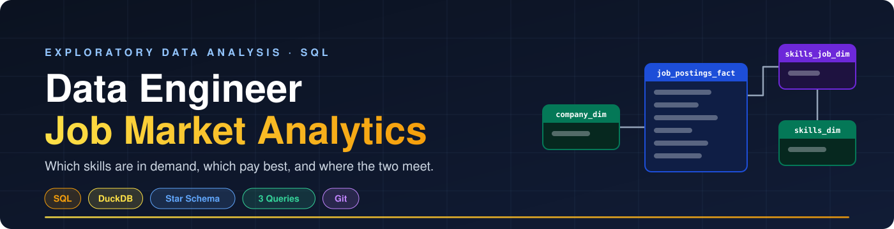

<div align="center">



# 🔍 Exploratory Data Analysis with SQL
### Which skills should a data engineer learn? Let the job postings answer.


</div>

A SQL project that mines real-world data engineer job postings to answer one question: **where do demand and salary meet?** It shows how I write production-quality analytical SQL, design efficient queries, and turn business questions into decisions.

---

## ⚡ 60-Second Summary (for Hiring Managers)

| | |
|---|---|
| 🎯 **Scope** | 3 analytical queries covering demand, pay, and a combined value score |
| 🧱 **Modeling** | Multi-table joins across fact, dimension, and bridge tables |
| 📈 **Techniques** | Aggregations, filtering, `HAVING`, log-scaling, top-N ranking |
| 💡 **Outcome** | Actionable findings on SQL/Python dominance, cloud demand, and salary premiums |

**Start here:**

1. [`01_top_demanded_skills.sql`](./01_top_demanded_skills.sql): demand analysis with multi-table joins
2. [`02_top_paying_skills.sql`](./02_top_paying_skills.sql): salary analysis with aggregations
3. [`03_optimal_skills.sql`](./03_optimal_skills.sql): demand/salary optimization score

---

## 🧩 The Questions


| # | Question | Approach |
|---|---|---|
| 🎯 | **Most in-demand:** which skills do data engineers need most? | Count postings per skill |
| 💰 | **Highest paid:** which skills command top salaries? | Median salary per skill |
| ⚖️ | **Best trade-off:** what balances demand and pay? | Log-scaled demand combined with median salary |

---

## 🗄️ Data Model

The data lives in a **star schema** data warehouse:


| Table | Type | Role |
|---|---|---|
| `job_postings_fact` | Fact | Titles, locations, salaries, dates |
| `company_dim` | Dimension | Company details |
| `skills_dim` | Dimension | Skill names and types |
| `skills_job_dim` | Bridge | Resolves the many-to-many link between postings and skills |

---

## 🔎 Key Insights

| | Finding |
|---|---|
| 🧠 | **SQL and Python are the foundation**, each appearing in ~29,000 postings |
| ☁️ | **AWS and Azure** are critical for modern data engineering roles |
| 🧱 | **Kubernetes, Docker, and Terraform** are associated with premium salaries |
| 🔥 | **Apache Spark** pairs strong demand with competitive compensation |

> **Takeaway:** master SQL + Python first, then add cloud and infrastructure tooling to move up the salary curve.

---

## 🏗️ Analysis Breakdown

| Query | What it does |
|---|---|
| [**Top Demanded Skills**](./01_top_demanded_skills.sql) | Finds the 10 most in-demand skills for remote data engineer roles |
| [**Top Paying Skills**](./02_top_paying_skills.sql) | Ranks the 25 highest-paying skills with salary and demand metrics |
| [**Optimal Skills**](./03_optimal_skills.sql) | Scores skills using the natural log of demand combined with median salary |

<details>
<summary><b>🧪 Why log-scale demand?</b></summary>

Raw posting counts are heavily skewed: SQL and Python dwarf everything else, so they would swamp the salary signal. `LN()` compresses that range, letting a niche, high-paying skill compete fairly with a ubiquitous one. A `HAVING COUNT(*) >= 100` filter keeps tiny samples from producing misleading medians.

</details>

---

## 💻 SQL Skills Demonstrated

| Area | Techniques |
|---|---|
| **Query design** | Multi-table `INNER JOIN` across `job_postings_fact`, `skills_job_dim`, `skills_dim` |
| **Aggregation** | `COUNT()`, `MEDIAN()`, `ROUND()` |
| **Filtering** | `WHERE` with multiple conditions (`job_title_short`, `job_work_from_home`, `salary_year_avg IS NOT NULL`) |
| **Ranking** | `ORDER BY ... DESC` with `LIMIT` for top-N |
| **Grouping** | `GROUP BY` skill for categorical analysis |
| **Math** | `LN()` to normalize demand; derived optimal score |
| **Quality** | `HAVING` for minimum sample size; NULL-safe salary handling |

---

## 🧰 Tech Stack

| | Tool | Purpose |
|---|---|---|
| 🐤 | **DuckDB** | Fast OLAP-style analytical queries |
| 🧮 | **SQL** | ANSI-style with analytical functions |
| 📊 | **Star schema** | Fact + dimension + bridge tables |
| 🛠️ | **VS Code + DuckDB CLI** | Editing and execution |
| 📦 | **Git/GitHub** | Versioned SQL scripts |

---

## 📂 Repository Structure

```text
SQL_Data_Engineering_Course/
│
├── 🖼️ images/
│   ├── banner.svg                  # Project banner
│   ├── star_schema.svg             # Warehouse diagram
│   └── analysis_flow.svg           # Question → query → insight
│
├── 📚 lessons/
│   └── ...                         # Course lessons & learning materials
│
└── 🚀 projects/
    │
    └── 1_EDA/
        ├── 01_top_demanded_skills.sql    # Demand analysis
        ├── 02_top_paying_skills.sql      # Salary analysis
        ├── 03_optimal_skills.sql         # Demand/salary optimization
        └── README.md                     # Project documentation
```

---

## ▶️ Run It Yourself

```bash
duckdb                              # open the DuckDB CLI
.read 01_top_demanded_skills.sql    # run any script in order
```