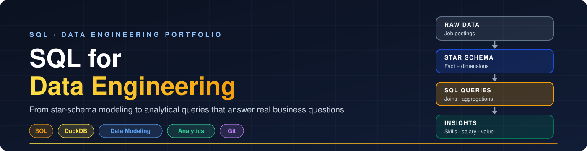
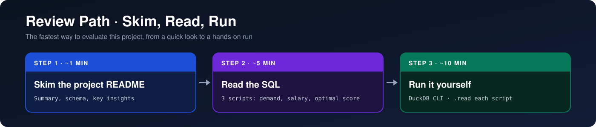
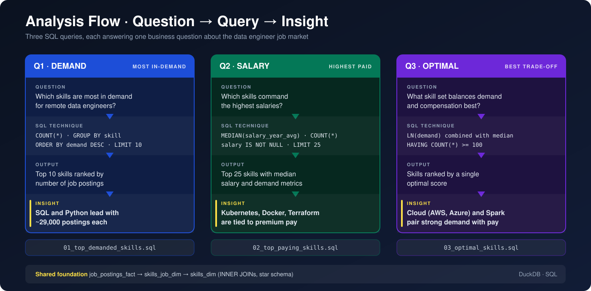
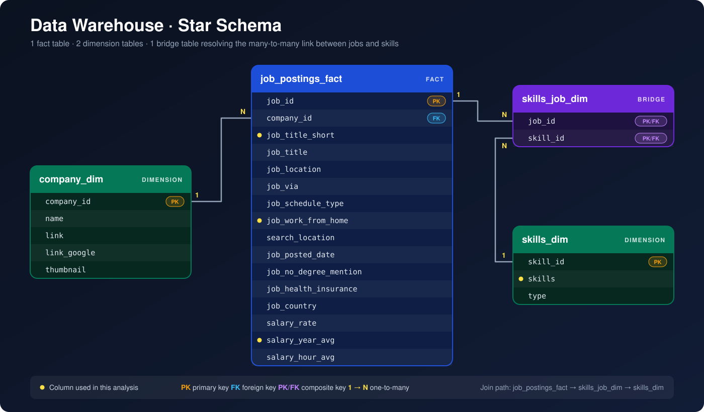
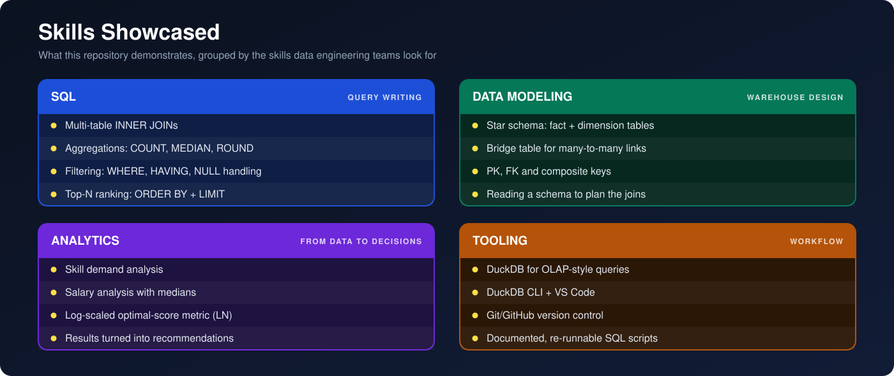

<div align="center">



# 🗃️ SQL for Data Engineering
### Hands-on SQL, data modeling and analytics, built to answer real business questions.


</div>

This repository is my SQL for data engineering portfolio: course lessons plus hands-on projects, starting with an analysis of real data engineer job postings. It shows how I model data, write analytical SQL, and turn raw tables into decisions.

---

## ⏱️ 60-Second Summary (for Recruiters & Hiring Managers)

| | |
|---|---|
| 🔭 **What it is** | A SQL portfolio: a flagship analysis project backed by course lessons |
| 🏛️ **Data model** | Star schema warehouse with a fact table, two dimensions, and a bridge table |
| 🧮 **Skills shown** | Multi-table joins, aggregations, `HAVING`, log-scaling, top-N ranking |
| 🏁 **Outcome** | Data-backed answers on which skills are in demand, which pay best, and where the two meet |

**Start here:**

👉 [**Project 1: Exploratory Data Analysis with SQL**](Projects/1_EDA): the full write-up with schema, queries, and key insights

---

## 🧭 Review Path



| Step | Where | What you get |
|---|---|---|
| **1. Skim** | [`projects/1_EDA/README.md`](Projects/1_EDA/README.md) | Summary, data model, key insights |
| **2. Read** | [`01_top_demanded_skills.sql`](Projects/1_EDA/01_top_demanded_skills.sql), [`02_top_paying_skills.sql`](Projects/1_EDA/02_top_paying_skills.sql), [`03_optimal_skills.sql`](Projects/1_EDA/03_optimal_skills.sql) | The actual SQL, one question per script |
| **3. Run** | DuckDB CLI | Reproduce the results yourself |

---

## 🚀 Featured Project

| | |
|---|---|
| **Project** | [🗃️ Exploratory Data Analysis with SQL: Job Market Analytics](Projects/1_EDA/README.md) |
| **Question** | Which skills should a data engineer learn? |
| **Approach** | 3 queries: demand, salary, and a combined demand/salary score |
| **Stack** | DuckDB · SQL · Star schema · Git/GitHub |



### 📌 Headline Findings

| | Finding |
|---|---|
| 🐍 | **SQL and Python are the foundation**, each appearing in ~29,000 postings |
| ☁️ | **AWS and Azure** are critical for modern data engineering roles |
| ⚙️ | **Kubernetes, Docker, and Terraform** are associated with premium salaries |
| ⚡ | **Apache Spark** pairs strong demand with competitive compensation |

---

## 🏛️ Data Model at a Glance



---

## 📚 Skills Showcased



---

## 📂 Repository Structure

```text
SQL_Data_Engineering_Projects/
│
├── 🖼️ images/
│   ├── repo_banner.svg             # Repository banner
│   ├── review_path.svg             # Skim → Read → Run
│   ├── skills_map.svg              # Skills overview
│   ├── banner.svg                  # Project banner
│   ├── star_schema.svg             # Warehouse diagram
│   └── analysis_flow.svg           # Question → query → insight
│
├── 📚 lessons/
│   └── ...                         # Course lessons & learning materials
│
├── 🚀 projects/
│   └── 1_EDA/
│       ├── 01_top_demanded_skills.sql    # Demand analysis
│       ├── 02_top_paying_skills.sql      # Salary analysis
│       ├── 03_optimal_skills.sql         # Demand/salary optimization
│       └── README.md                     # Project documentation
│
└── README.md                       # You are here
```

---

## ▶️ Run It Yourself

```bash
git clone https://github.com/archnetpro/SQL_Data_Engineering_Projects.git
cd SQL_Data_Engineering_Projects
duckdb                                            # open the DuckDB CLI
.read projects/1_EDA/01_top_demanded_skills.sql   # run any project script
```

> The scripts expect the star-schema tables (`job_postings_fact`, `company_dim`, `skills_dim`, `skills_job_dim`) to be available in your DuckDB session. See the [project README](Projects/1_EDA/README.md) for the data model.

---

## ☍ Let's Connect

I'm open to data engineering opportunities. Feel free to reach out:

- 📧 **Email:** rado590@abv.bg
- 🌐 **GitHub:** [archnetpro](https://github.com/archnetpro)
